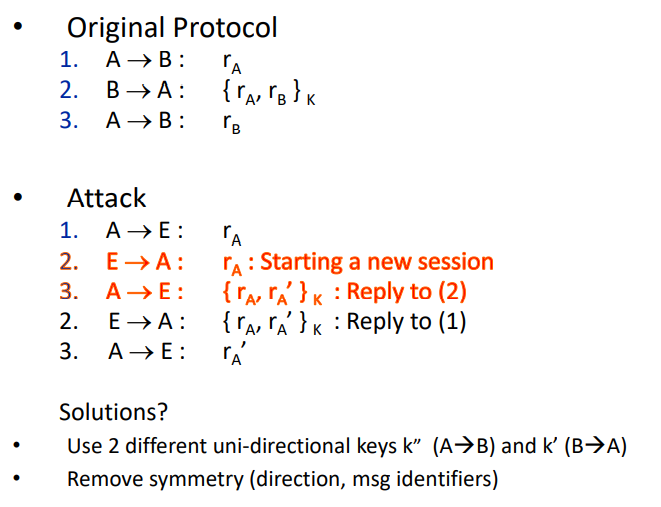
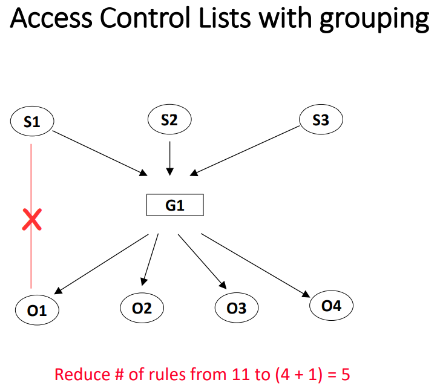

### Lecture 10: Protocols

* **"reflection" attack"**

  

  * To fix: **breaking the symmetry**
    * K_ab for A->B and K_ba for B->A
  * Or, include **explicit direction identifier**
  * Variants of Nonce can be use
    * Sequence #s
    * Time-Stamps

#### TTP, KDC, and CA

* **Trusted Third Party** (TTP)
  * Symmetric Key Problem: Mutually trusted on-line **key distribution center** (KDC)
    * Responsible for distributing keys to pairs of users
    * Each user must share a unique master key with the KDC
      * Use this key to communicate with KDC to get a temporary session key for establishing a secure “session” with another user/program/host/entity
      * Each master key is distributed (agreed upon) in some off-line fashion
    * 
  * Public Key Problem: 
    * Public announcement (e.g., in a newsgroup or email message)
      * can be forged (伪造)
    * Publicly available directory
      * can be tampered with (篡改)
    * Trusted off-line **certification authority** (CA) as TTP
      * trusted, highly secure (physically and electronically) component
      * Issues public key certificates; each binds a public key to a specific entity
      * 

#### NS (Needham-Schroeder) protocol and Denning-Sacco attack

* Needham-Schroeder Protocol (1978)

  * First Distributed Security Protocol

    

  * Denning-Sacco Attack: Eve **recorded** **an old protocol session** for which she somehow **knows** the session key **K**‘:

    

  * Fix: Adding timestamps

    

    * Limits usefulness of old session keys

#### PK-based NS protocol and Lowe’s attack

* 
* Attack:
  * 1, 2, 4, 5: Delivery of public key 
  * Does not guarantee freshness of the public key
  * Fix: 
    * Timestamp in messages 2 and 5 or challenges in messages 1&2 and 4&5 
    * Public Key Certificate: assign expiration time/data to each certificate (messages 2 and 5)
* Lowe’s Attack: (Impersonation by Interleaving)
  * 
  * Fix: Add sender info ["B”, N_a, N_b]PKa
  * 

* More examples on attacks on protocol
  * 
  * 

### Lecture 11&12: Public Key Distribution, Public Key Certification and Revocation

* Public Key Infrastructure (Distribution)
  * to determine the correct public key of a given entity, binding between **IDENTITY** and **PUBLIC KEY**
  * Possible Attacks:
    * <u>Name spoofing</u>: Eve associates Alice’s name with Eve’s public key 
    * <u>Key spoofing</u>: Eve associates Alice’s key with Eve’s name 
    * (Denial-of-Service)<u>DoS</u>: Eve associates Alice’s name with a random key

##### Certificates

*  = explicit binding between **a public key** and **its owner’s** (unique) name
* Must be issued (and signed) by a recognized **trusted** Certificate Authority (**CA**)
* Issuance is done **off-line**

* The Man-in-the-Middle (MitM) Attack
  * Root cause: Alice has no way to verify whether ye is associated with Bob’s identity or not!
* Authenticated Public-Key-based Key Exchange (Station-to-Station or STS Protocol)

* How it work
  * A public/private key-pair is generated by user 
  * User requests certificate via a local application (e.g., web browser, email, in person, etc.)
    * Good idea to prove knowledge of private key as part of the certificate request. To prevent spoofing.
  * Public key and owner’s name are part of a certificate 
  * Private keys only used for **small amount of data** (signing, encryption of session keys) 
  * Symmetric keys (e.g., AES) used for **bulk** data encryption
* CA must **verify/authenticate** the entity requesting a new certificate.
* CA’s own certificate is signed by **a higher-level CA**. Root CA’s certificate is self-signed and pre-installed in devices 
* CA is a critical part of the system and must operate in a secure and predictable way according to some policy.
* Alice’s certificate is checked by whomever wants to: 
  * 1) verify her signatures, and/or 
  * 2) encrypt data for her
* A signature verifier (or encryptor) must: 
  * know the public key of the CA(s) 
  * trust all CAs involved
* Certificate checking is: verification of the signature and validity
* Validity: expiration + revocation checking
* CA security
  * Must minimize risk of CA private key being compromised 
  * Best to have an **off-line** CA 
    * Requests may come in electronically but should not be processed in real time 
  * In addition, using **tamper-resistant** **hardware** for the CA would help (ideally, to make it impossible to extract CA’s private key)

##### X.500 

* X.500 Distinguished Names (DNs)
  * C Country 
  * SP State/Province 
  * L Locality 
  * O Organization 
  * OU Organizational Unit 
  * **CN Common Name**
* ISO standard for directory services
* Global, distributed
* Data model:
  * Based on **hierarchical** namespace 
  * **Directory Information Tree** (DIT) 
  * Geographically organized 
  * Entry is defined with its **DN** (Distinguished Name)
  * Searching: 
    * You must select a location in DIT to base your search 
    * A one-level search or a subtree search 
    * Subtree search can be slow
* **LDAP**: Lightweight Directory Access Protocol
  * referral model instead original chaining

##### PKI and X.509 certificate format

* Hierarchical Public Key Infrastructure (PKI)

  

  * Certificate Paths
    * Verifier must know public key of the first CA (usually the root CA)

* X.509 Standard

  * current X.509v3
  * Defines certificate format, not PKI
  * End users cannot be CAs
  *  defined in Abstract Syntax Notation 1 (ASN.1)
    * ASN.1 structure is encoded using the Distinguished Encoding Rules (DER)
      * A DER-encoded binary string is typically base-64 encoded to get an ASCII representation 

##### Certificate revocation methods: CRL, CRT, OCSP, CRS

* Certificate is a **capability**
* Certificate revocation needs to occur when: 
  * certificate holder key compromise/loss 
  * CA key compromise 
  * end of contract (e.g., certificates for employees)
* CA issues a **Certificate Revocation List (CRL)**  
  * Distributed/published in public announcements/databases
  * CRL should be reissued periodically, even there if no new revocation activity!

* Requirements for Revocation 
  * Timeliness
  * Efficiency
  * Security
* Types of Revocation
  * Explicit
    * Only revoked certificates are periodically announced 
  * Implicit
    * Each certificate is frequently/periodically re-issued
* Revocation Methods
  * Explicit: 
    * **CRL - Certificate Revocation List** 
      * Sources: CRL-DP, indirect CRL, dynamic CRL-DP 
      * Delta-CRL, windowed CRL, etc. 
      * **Certificate Revocation Tree (CRT)** and other Authenticated Data Structures 
    * **OCSP – On-line Certificate Status Protocol** 
  * Implicit: 
    * **CRS - Certificate Revocation System**

##### CRL

* Off-line mechanism 

* CRL = list of revoked certificates (e.g., SNs) signed by a revocation authority (RA)
* RA not always CA that issued the revoked PKC
* Periodically issued: daily, weekly, monthly, etc
* Pros 
  * Simple 
  * Does not need secure channels for CRL distribution 

* Cons 
  * Timeliness: “window of vulnerability” 
  * **CRLs grow and can become huge** 
    * => CRT
  * How to distribute CRLs reliably

##### CRT

* Based on Merkle hash trees

  

* Express ranges of SN of PKC’s as tree leaf labels: 

  * E.g., (5—12) means: 5 and 12 are revoked, those larger than 5 and less than 12 are okay • Place the hash of the range in the leaf

* Response includes 

  * (1) the corresponding **tree leaf**, 
  * (2) the necessary hash values along the path to the root (called **co-path**), 
  * (3) **the signed root**

* Each response (leaf + co-path) represents a proof

  * Length of proof is: O(log n)

##### OCSP: On-line Certificate Status Protocol

* Conveys instantaneous status of a PKC
* Used **in place of** or, as a **supplement** to, checking CRLs (window of vulnerability)
* Especially suitable for **sensitive**, volatile settings, e.g., stock trades, electronic funds transfer, military

##### CRS: Certificate Revocation System

* Aims to improve CRL communication costs 
* Basic idea: CA periodically refreshes valid certificates 
* Uses off-line/on-line signature scheme to reduce update cost

###  Lecture 13: Access Control

Model and Terminology 

* prevent misuse of resources = control access to them
* **who** can access **what**, **how** and **when**
* **Subjects**: users or processes
* **Objects**: resources (files, memory, printers, routers, plotters, disks, processes, etc., etc.,...)

* Access Modes

  * “Look” at an object
  * “Change” an object
  * **Bell-Lapadula model**
    * 4 mode of access: execute, read, append, and write
  * UNIX/Linux/*x Operating Systems
    * execute, read, and write
  * Windows NT/2000 (NTFS)
    * execute • read • write • delete • change permission • change ownership

* AC Types

  * **Discretionary Access Control (DAC)**: resource owner
    * Android
    * Typical form of access control in Linux and many other Unix-derived OS-s
    * Access to data is entirely at the discretion of the owner/creator of the data
  * **Mandatory Access Control (MAC): **system-wide policy

* Access Control Structures

  * MAC: **Access Control Matrix** 

    

  * MAC: **Access Control Lists** 

    * Keep access rights to an object with that object
    * 
      * As many ACLs as there are **objects** 
      * Each ACL either signed or stored in protected place 
      * Faster when subject # < **object #**
    * Managing access rights can be difficult => Groups simplify definition of access control policies
      * 

  * DAC: **Capabilities**

    * difficult to get full view of who has permission to access an object=>associated with owner
    * Keep access rights with the subject
    * 
      * As many capabilities as there are **subject/object pairs** 
      * Each capability either signed or otherwise protected 
      * **Hard to revoke in a distributed setting** --- owners and objects have to keep track of all issued capabilities 
      * Faster when **subject #** > object #
    * Centralized Systems: ACLs/MAC are better 
    * Distributed Systems: Capabilities/DAC are better

  * **Role Based Access Control (RBAC)**
    * Users are associated with roles
    * Roles are associated with permissions
    * A user has permission only if s/he has a role associated with that permission
    * A bit similar to AC that only has groups as subjects, no single user

* * 