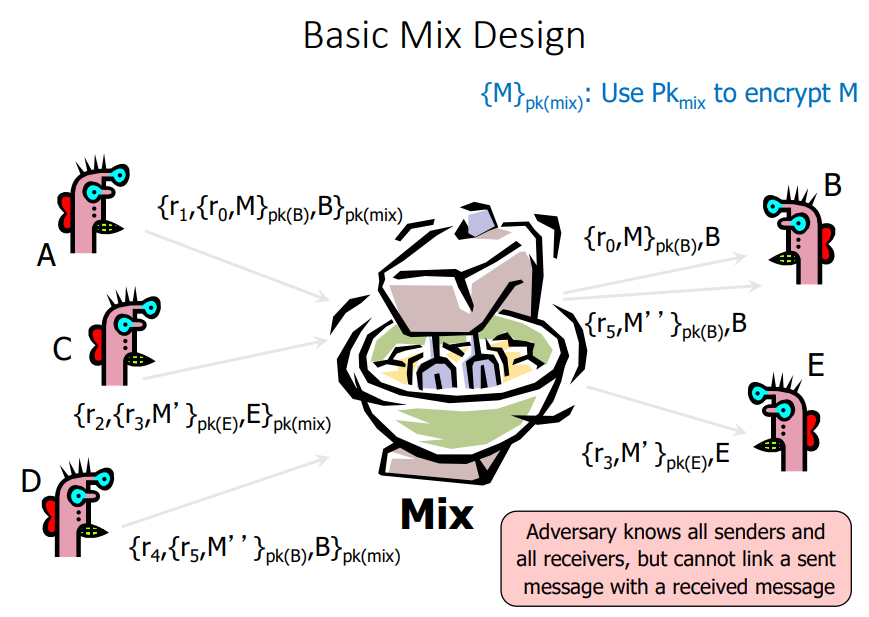
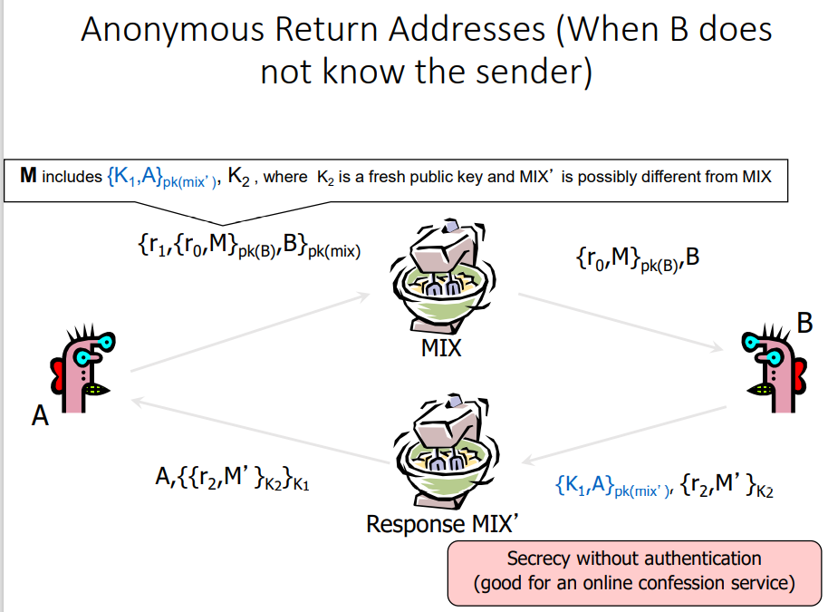
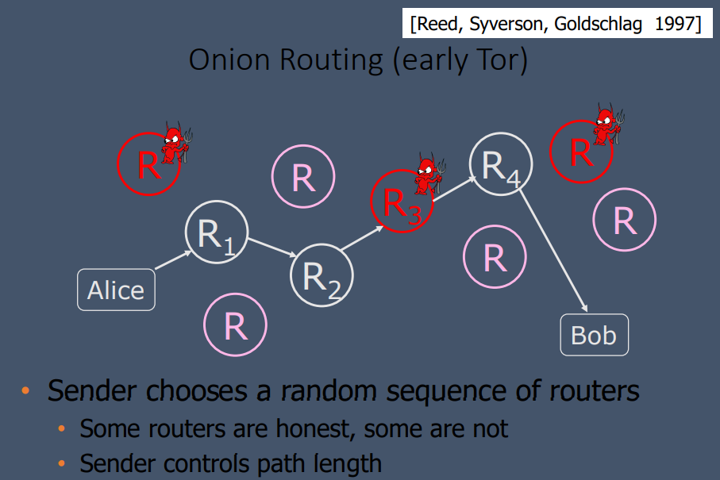
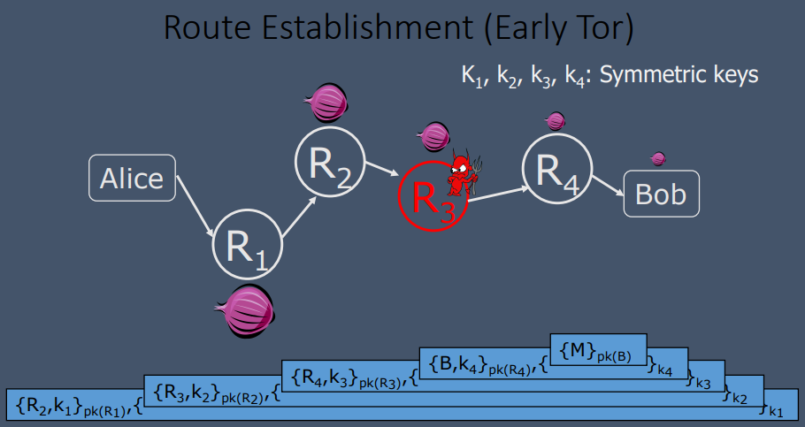
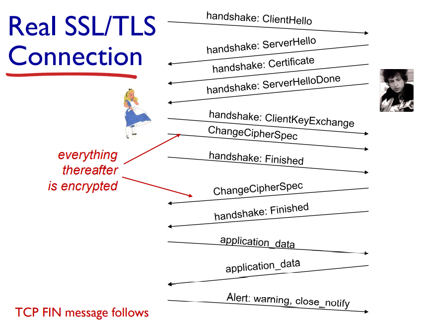
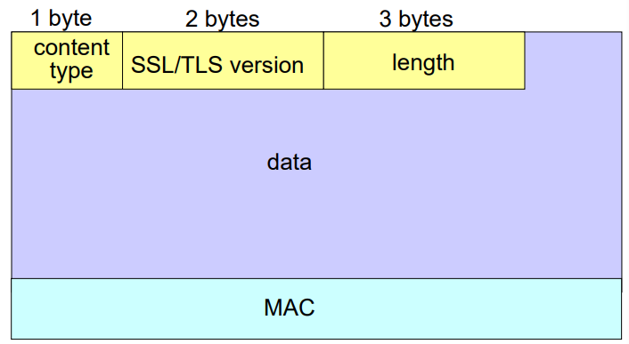
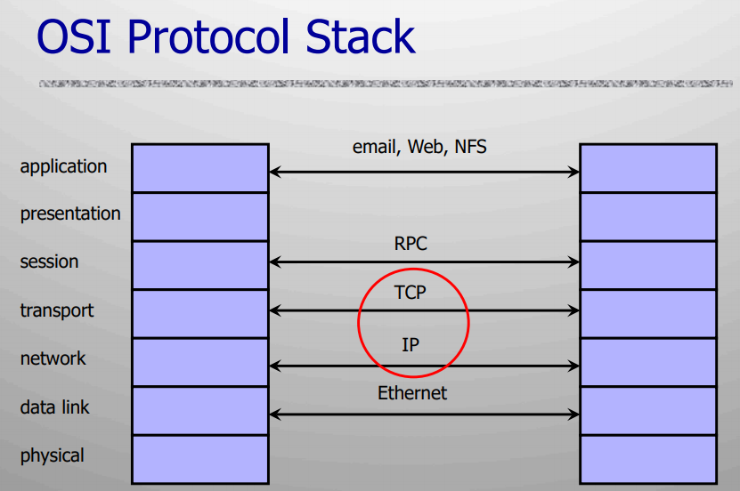
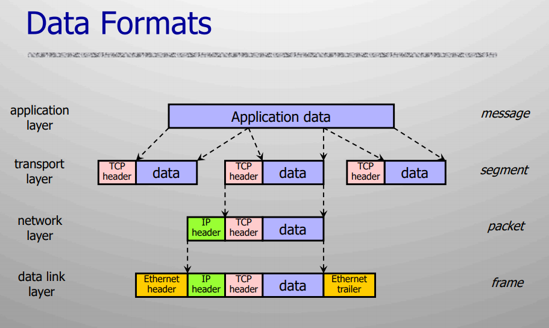
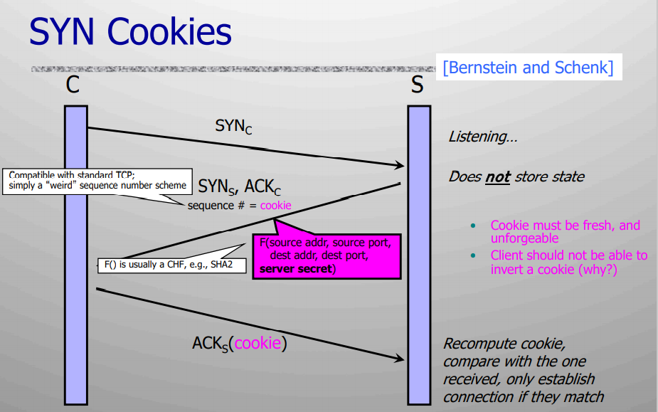

### Lecture 14: Privacy and Anonymity

Definitions 

**Anonymity**: inability to identify someone within a set of subjects (size varies)

**Unlinkability**: separation of action and identity performing that action

**Unobservability**: inability to tell whether a certain action took place

Applications 

* Digital/Electronic Cash

##### Types of Attacks 

* Passive Traffic Analysis
  * Infer from network traffic who is talking to whom 
  * To hide your traffic, must carry other people’s traffic! 
* Active Traffic Analysis 
  * Inject packets or put a timing signature on a packet flow 
* Compromise of Network Nodes (such as Routers) 
  * Not obvious which nodes have been compromised 
    * Attacker may be passively logging traffic 
  * Do not fully trust any individual node 
    * Assume that some fraction of nodes is good, but do not know which

**Chaum's Mix**: Earliest proposal for anonymous email

* Public-key crypto + trusted re-mailer (Mix)

  

  

* Mix Cascade 
  * Messages are sent through **a sequence of mixes**
  * Can also form an arbitrary network of mixes (“mixnet”)
  * Some mixes may be controlled by attacker, but even a single good mix guarantees some anonymity
  * *Pad* and *buffer traffic* to foil **correlation attacks**
* Disadvantages
  * Public-key encryption and decryption at each mix are computationally expensive
  * Basic mixnets have high latency
  * Challenge: low-latency anonymity network
    * Use public-key cryptography to establish a “circuit” with pairwise symmetric keys between hops on the circuit
    * Then use symmetric decryption and re-encryption to move data messages along the established circuits

##### Tor 

* Hide sources by routing messages randomly

* Routers do not know if the apparent source of a message is the true sender or another router

* Sender chooses a random sequence of routers

* Onion Routing (early Tor)

  

  

* Tor circuit 

  * Client proxy establishes a symmetric session key and circuit with Onion Router #1
  * Client proxy extends the circuit by establishing a symmetric session key with Onion Router #2
  * Client proxy extends the circuit by establishing a symmetric session key with Onion Router #3
  * Client applications connect and communicate over the established Tor circuit (also to multiple dst-s)
    * Datagrams are decrypted and re-encrypted at each link

* Issues

  * Many applications can share one circuit 
    * Multiple TCP streams over one anonymous connection
  * Tor router do not need root privileges
    * Encourages people to set up their own routers 
    * More participants = better anonymity for everyone
  *  Directory servers
    * Maintain lists of active onion routers, their locations, current public keys, etc.
    * Control how new routers join the network 
      * **“Sybil attack**”: attacker creates a large number of routers
    * Directory servers’ keys ship with Tor code 

##### DC (Dining Cryptographer) protocol

* How to make a message public, but in a perfectly untraceable manner
* Guarantees <u>information-theoretic</u> anonymity for message senders 
  * VERY strong form of anonymity: defeats adversary who has unlimited computational power
* Difficult to make practical 
  * In group of size N, need N random bits to send 1 bit
* Three-person DC Protocol
  * Each diner flips a coin and shows it to his left neighbor. 
    * Every diner sees two coins: his own and his right neighbor’s
    * Each diner announces whether the two coins are the same. If he is the payer, he lies (says the opposite).
    * IF Number of “ same ”=1 or 3 ⇒ One is paying 
    * IF Number of “ same ”=0 or 2 ⇒ one of them is paying
* Group size N
  * For each bit of the message, every user generates 1 random bit and sends it to ONE neighbor 
    * Every user learns 2 bits (his own and his neighbor’s)
  * Each user announces own bit XOR neighbor’s bit
  * Sender announces own bit XOR neighbor’s bit **XOR message bit**
  * **XOR all announcements = message bit**
    * Every randomly generated bit occurs in this sum twice (and is canceled by XOR), message bit occurs once

### Lecture 15: Transport Layer Security/Secure Socket Layer (TLS/SSL)

* SSL/TLS provides application programming interface (API) to applications

* above TCP/IP

  

* **cipher suite**

  * allow client and server to support different encryption algorithms
  * allow client and server to choose together specific algorithm before data transfer
  * public-key algorithm 
    * RSA, DH, EC-DH, DSA...
  * symmetric encryption algorithm 
    * AES, 3DES...
  * MAC algorithm
    * SHA-256, SHA-128...
  * negotiation: client, server agree on a cipher suite 
    * client offers choice 
    * server picks one

* **handshake**: Alice and Bob use their certificates, private keys to authenticate each other and exchange a shared secret

  * Purpose 
    * server authentication 
    * negotiation: agree on crypto algorithms 
    * establish keys 
    *  client authentication (optional)
  * Procedure:
    * client sends <u>a list of algorithms</u> it supports, along with <u>a client **nonce**</u>
    * server chooses <u>algorithms</u> from list; sends back: choice + own <u>certificate</u> + <u>server **nonce**</u>
    * client <u>verifies certificate</u>, extracts server’s public key, generates <u>pre_master_secret</u>, encrypts with server’s public key, sends to server 
    * client and server independently <u>compute encryption</u> and <u>MAC keys</u> from pre_master_secret and both nonces 
    * client sends a <u>MAC</u> of all handshake messages 
    * server sends a <u>MAC</u> of all the handshake messages
      *  MAC: protect handshake from tampering
        * man-in-the middle could delete stronger algorithms from list
        * MAC prevent this

* **key derivation**: Alice and Bob use shared secret to derive set of keys

  * considered bad to use same key for more than one cryptographic operation 
    * =>use different keys for message authentication code (MAC) and encryption
  * four keys:
    * Kc = encryption key for data sent from client to server 
    * Mc = MAC key for data sent from client to server 
    * Ks = encryption key for data sent from server to client 
    * Ms = MAC key for data sent from server to client
  * keys derived from key derivation function (KDF)
    * takes master secret and (possibly) some additional random data and creates the keys
  * In practice:
    * client **nonce**, server nonce, and pre-master secret input into **pseudo random-number generator** (PRG)
    * master secret and new nonces input into another random-number generator: “key block”
    * key block used to derive separate: 
      * client MAC key 
      * server MAC key 
      *  client encryption key 
      * server encryption key 
      * client initialization vector (IV) 
      * server initialization vector (IV)

* **data transfer**: data to be transferred is broken up into series of records

  * SSL/TLS Record Format:
    * 
  * receiver can act on each record as it arrives
  * issue: in record, receiver needs to distinguish MAC from data
  * **Sequence Numbers**: attacker can capture and replay or re-order records=> put sequence number into MAC
    * MAC = MAC(Mx, sequence||data)

* **connection closure**: special messages to securely close connection

  * **Control Information**: 

    *  **truncation attack**: attacker forges TCP connection close segment
    * record types, with special type for closure 
      * type 0 for data; type1for closure

    * MAC = MAC(Mx, sequence||type||data)

### Lecture 16: Network Security/Threats

Background:

* TCP/IP for packet routing and connections 

* Border Gateway Protocol (BGP) for external route discovery 

* Domain Name System (DNS) for IP address discovery
* 
* 
* TCP (Transmission Control Protocol)
  * Connection-oriented for reliable transmission
  * Sender: break data into segments 
    * Sequence number is attached to every packet
  * Receiver: reassemble segments 
    * Acknowledge receipt; lost packets are re-sent
  * Connection state maintained by both sides
* IP (Internet Protocol)
  * Connectionless
    * Unreliable, “best-effort” protocol
  * Uses addresses (and prefixes thereof) used for routing
* ICMP (Control Message Protocol)
  * Provides feedback about network operation
    * Error reporting, congestion control, reachability, etc.

##### Eavesdropping (packet sniffing) 

* Network packets pass by and thru **untrusted** hosts
* Many old applications send data **unencrypted**
* Solution: **encryption** (e.g., IPsec), improved routing

**Smurf attacks**: IP addresses are public

* 1. ICMP Echo Req 

     ​	Src: victim’s address 

     ​	Dest: broadcast address

  2. Every host on the segment generates a ping reply (ICMP Echo Reply) to victim’s address

  3.  Flood of ping replies **overwhelms** victim

* Solution: reject external packets to broadcast addresses

**Ping-of-Death** : IP addresses are public

* When an old Windows machine receives an ICMP packet with payload over 64K, it **crashes** and/or reboots
* Solution: patch OS, filter out ICMP packets

**SYN flooding** : TCP connection requires state; 

* Attacker sends many connection requests (SYNs) with spoofed source (IP) addresses

* Victim allocates resources for each request
  * New thread, connection state maintained until timeout 
  * Fixed bound on half-open connections
* Once server resources are exhausted, requests from legitimate clients are denied
* This is a classic **DoS** attack example:  caused by asymmetric state allocation
  * Common pattern: it costs nothing to TCP client to send a connection request, but **server must do sth really expensive for each request** 
  * Other examples of this behavior? – TLS/SSL server public key decryption
* Solutions:
  * **Cookies** allow server to remain stateless until client produces
  * 
  * Client sends request (message #1) to server
  * Server responds with hashed connection data instead of message #2
  * Client confirms by returning cookie (with other fields)
* Passive Defense:  **Random Deletion**
  * If SYN queue is full, <u>delete random entry</u> in table of half-open connections on server

**TCP spoofing and connection hijacking** : TCP state easy to guess

* Each TCP connection has associated “state” info
* Port numbers are standard, seq numbers are predictable
* Can inject packets into existing connections
  * If attacker knows <u>initial sequence number</u> and <u>amount of traffic</u>, can guess current number
  * Most systems accept a large window of sequence numbers 
  * Send a flood of packets with likely sequence numbers
* DoS by Connection Reset
  * If attacker can guess the current sequence number for an existing connection, can send a **reset** packet to close it (RST flag=1 in TCP header)

##### Countermeasures

* Above transport layer: Kerberos 
  * Provides <u>authentication</u>, protects against application layer <u>spoofing</u> 
  * Does not protect against connection hijacking 
* Above network layer: SSL/TLS and SSH
  * Protects against <u>connection hijacking</u> and <u>injected data</u>
  * Does not protect against DoS by spoofed packets 
* Network (IP) layer: IPsec 
  * Protects against <u>hijacking</u>, <u>injection</u>, <u>DoS</u> using connection resets, IP address <u>spoofing</u> 
  * But muddled/poor key management…

### Lecture 17 & 18: Cryptography in Real World

* How pin tumbler lock works and lock picking
* In-vehicle network security
  * A distributed system! Electronic Control Unit (ECU)
  * No encryption, no signature/MAC at the design time
  * now it has already used too widespread, and nearly impossible to replace it
* Still the lack of secure protocol design at CAN!
* Due to the lack of any confidentiality, integrity, and authenticity protections, the entire in-vehicle system cannot tolerant even one single malicious ECU
* workarounds that cannot provide strong guarantees
  * Firewalls and IDS (Intrusion Detection System) 
  * To authenticate the sender ECU without crypto: design ECU fingerprinting methods using software/hardware properties (e.g., clock skews, energy pattern, etc.)
  * Cannot guarantee no false alarms or no false negatives
  * 