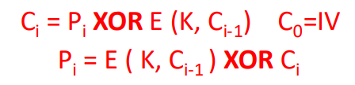

## Lec1: Introduction

* Attacks, Services and Mechanisms

  * Security Attack: an action (or event) that aims to compromise (undermine) security of information or resource 

    

    * interruption: attack on availability
    * interception: attack on confidentiality
    * modification: attack on integrity
    * fabrication: attack on authenticity

  * Security Mechanism: a measure (technique or method) designed to detect, prevent, or recover from, a security attack 

    * Cryptography -> confidentiality, authentication, identification, integrity, etc. 
    * Software Controls (e.g., in databases, operating systems) -> protect system from users and users from each other 
    * Hardware Controls (e.g., smartcards, badges, biometrics) -> authenticate holders (users) 
    * Policies (e.g., frequent password changes, separation of duty rules) -> prevent insider attacks 
    * Physical Controls (doors, guards, moats, etc.) -> physical access controls

  * Security Service: something that enhances security. A “security service” makes use of one or more “security mechanisms” 

    * Confidentiality: to assure information privacy and secrecy 

    * Authentication: who created or sent data 

    * Integrity: data has not been altered 

    * Access control: prevent misuse of resources 

    * Availability: offer access to resources, permanence, non-erasure 

      * Examples of attacks on Availability: 

        * Denial of Service (DoS) Attacks 

          • e.g., against a DNS name server or Bank Web server 

        * Malware (ransomware) that deletes or encrypts files

* Security Threats

  

## Lec2: Cryptography: History and Simple Encryption Methods

* Historical Ciphers

  * Rosettat stone
  * Enigma
  * Historical (Primitive) Ciphers
    * Shift (e.g., Caesar): $Enc_k(x) = x+k mod 26$
    * Affine: $Enc_{k1,k2}(x) = k_1 * x + k_2 mod 26 $
    * Substitution: $Enc_{perm}(x) = perm(x)$
      * can be attacked by analyzing frequencies
    * Vigenere: EncK(x) = ( X[0]+K[0], X[1]+K[1], …, X[n]+K[N])
    * Vernam: One-Time Pad (OTP)

* Crypto Terminology

  * seems unimportant
    * work at different levels
    * Open design:  algorithm, protocol, system design (and even possible plaintext) are public information. Only key(s) are kept secret.
    * Closed design: as much information as possible is kept secret.
    * effective &  unobrusive
  * A cryptosystem has (at least) five ingredients: 
    * – Plaintext – Secret Key k – Ciphertext – Encryption Algorithm – Decryption Algorithm
    * Security usually depends on the secrecy of the key k, not the secrecy of the algorithms
  * Types of Attainable Security 
    * Perfect, unconditional or “information theoretic”: the security is evident free of any (computational/hardness) assumptions 
    * Reducible or “provable”: security can be shown to be based on some common (often unproven) assumptions, e.g., the conjectured difficulty of factoring large integers 
    * Ad hoc: the security seems good -> “snake oil”…
  * Encryption scheme is computationally secure if 
    * cost of breaking it (via brute force) exceeds the value of the encrypted information; or
    * time required to break it exceeds useful lifetime of the encrypted information
  * Complexity
    * P: problems that can be solved in polynomial time, i.e., problems that can be solved/decided “efficiently” 
    * NP: broad set of problems that includes P; answers can be verified “efficiently” (in polynomial time); • solutions cannot always be efficiently found (as far as we know). 
    * NP-complete: believed-to-be-hard decision problems in NP; they appear to have no efficient solution; answers are efficiently verifiable, solution to one is never much harder than a solution to another
    * NP-hard: hardest; some of them may not be solved by a non-deterministic TM. Many computational version of NP-complete problems are NP-hard. 
  * Cryptosystems
    * Type of operations used for transforming plaintext into ciphertext 
      * Binary arithmetic: shifts, XORs, ANDs, etc. • Typical for conventional/symmetric encryption 
      * Integer arithmetic • Typical for public key/asymmetric encryption 
    * Number of keys used 
      * Symmetric or conventional (single key used) 
      * Asymmetric or public-key (2 keys: 1 to encrypt, 1 to decrypt) 
    * How plaintext is processed: 
      * One bit at a time – “stream cipher” 
      * A block of bits – “block cipher"

* Shifting, substitution, and OTP (One-Time Pad)

  * OTP

    

## Lec3&4: Encryption

#### Conventional/Symmetric Cryptograph

* Applications:
  * Message transmission (confidentiality): 
    * Communication over insecure channels 
  * Secure storage: crypt on Unix 
  * Strong authentication: proving knowledge of a secret without revealing it
    * Eve can obtain chosen  pair 
    * Challenge should be chosen from a large pool 
  * Integrity checking: fixed-length checksum for message via symmetric key cryptography 
    * Send MAC along with the message MAC=H(K, m)
* Advantages 
  * high data throughput 	
  * relatively short key size 
  * primitives to construct various cryptographic mechanisms 
* Disadvantages 
  * key must remain secret at both ends 
  * key must be distributed securely and efficiently 
  * relatively short key lifetime

#### Public Key (Asymmetric) Cryptography

* Asymmetric cryptography  
* Two keys: private (SK), public (PK) 
  * Encryption: with the other end’s public key; 
  * Decryption: with my own private key 
* Applications: 
  * Digital Signatures: Signing by private key; Verification by public key. i.e., “encrypt” message digest/hash -- h(m) -- with private key 
    * Authorship (authentication) 
    * Integrity: Similar to MAC 
    * Non-repudiation: can’t do with secret/symmetric key cryptography ??
  * Data transmission (confidentiality): Alice encrypts ma using PKB, Bob decrypts it to obtain ma using SKb.
  * Secure Storage: encrypt with own public key, later decrypt with own private key
  * Authentication: 
    * No need to store secrets, only need public keys. 
    * Secret/symmetric key cryptography: need to share secret key for every person you want to communicates with
* Advantages 
  * only the private key must be kept secret 
  * relatively long life time of the key 
  * more security services 
  * relatively efficient digital signatures mechanisms 
* Disadvantages 
  * low data throughput 
  * much larger key sizes 
  * distribution/revocation of public keys 
  * security based on conjectured hardness of certain computational problems 

#### Block Encryption

* Feistel Network

  * Block Size: larger block sizes mean greater security 

  * Key Size: larger key size means greater security 

  * Number of Rounds: multiple rounds offer increasing security 

  * Subkey Generation Algorithm: greater complexity leads to greater difficulty of cryptanalysis

    

  * Was not secure in any of its variants 

  * Called a Feistel or product cipher 

  * F()-function is a simple transformation, does not have to be reversible 

  * Each step is called a round; the more rounds, the greater the security (to a point)

#### Data Encryption Standard (DES)

* Block cipher (in native ECB mode) 
* Plaintext processed in 64-bit blocks 
* Key is 56 bits 

* 初始置换
* 加密

* key schedule 
  * Permutated Choice 1(PC1)：将长度为64位的输入，置换得到两个长度为28位的输出
  * Permutated Choice 2(PC2)：将长度为56位的输入，置换得到长度为48位的输出
  * Left Shifts(LS)：对输入进行位运算，向左循环移位

* Breaking DES (Cryptanalysis) 
  * DES Key size = 56 bits 
  * Brute force = $2^{55}$ attempts on avg 
  * Differential cryptanalysis = $2^{47}$ chosen plaintexts [BS’89] 
  * Linear cryptanalysis = $2^{43}$ known plaintexts [M’93]
  * More than 16 rounds do not make it any stronger 
  * DES Key Problems: •Weak keys (all 0s, all 1s, a few others) •Key size = 56 bits = 8 * 7-bit ASCII •Alphanumeric-only password converted to uppercase 8 * ~5-bit chars = 40 bits 

* Strengthen DES: 

  * 2-DES: C = DES ( K1, DES ( K2, P ) ) 

    * Meet-in-the-middle ATTACK (O(2^56 +2^56) operations + O(2^64) storage)

      

    * 57 effective key bits

  * 3-DES

    * C = E(K3, D(K2, E(K1,P) ) )
    * 112 effective key bits

  * DES-X

    * C= K3 XOR E(K2, (K1 XOR P) ) 
    * 118 effective key bits

#### Advanced Encryption Standard (AES): The Rijndael Block Cipher

* Allows only 128, 192, and 256-bit key sizes 
* Variable input block length: 128, 192, or 256 bits. All nine combinations of key-block length possible.
* Key is expanded to a set of n round keys 
* Input block P put thru n rounds, each with a distinct round sub-key. 
* Strength of algorithm relies on difficulty of obtaining intermediate results (or state) of round i from round i+1 without the round key.

* Each round performs the following operations: 
  * Non-linear Layer: No linear relationship between the input and output of a round 
  * Linear Mixing Layer: Guarantees high diffusion over multiple rounds 
    * Very small correlation between bytes of the round input and the bytes of the output 
  * Key Addition Layer: Bytes of the input are simply XOR’ed with the expanded round key

* Three layers provide strength against known types of cryptographic attacks: Rijndael provides “full diffusion” after only two rounds

* Considerable parallelism exists in the algorithm 
  * Each layer of Rijndael operates in a parallel manner on the bytes of the round state, all four component transforms act on individual parts of the block 
  * Although the Key expansion is complicated and cannot benefit much from parallelism, it only needs to be performed once when the two parties switch keys.

* Amenable to efficient implementation in both hw and sw; requires no special instructions to obtain good performance on any computing platform

#### Modes of Operation

##### Electronic Code-Book (ECB) Mode

* Duplicate plaintext blocks (patterns) visible in ciphertext
* Ciphertext block rearrangement is possible
* Parallel encryption and decryption (random access)

* Error in one ciphertext block = one-block loss

##### Cipher-Block Chaining (CBC) Mode

* Duplicate plaintext blocks (patterns) NOT exposed
* Block rearrangement is detectable 
* No parallel encryption but parallel decryption
* Error in one ciphertext block = two-block loss

##### Output Feedback (OFB) Mode

* Duplicate plaintext blocks (patterns) NOT exposed
* Block rearrangement is detectable 
* Key-stream is independent of plaintext 
  * parallel encryption & decryption
* Bit error in one ciphertext block = one-bit error in plaintext
* Can encrypt less than block size

##### Cipher Feedback (CFB) Mode

* Duplicate plaintext blocks (patterns) NOT exposed
* Block rearrangement is detectable 
* Key-stream is dependent on plaintext 
  * can't parallel encryption but parallel decryption
* Bit error in one ciphertext block = one-bit + one-block loss in plaintext 
* Can encrypt less than block size 

##### Counter (CTR) Mode

* Duplicate plaintext blocks (patterns) NOT exposed, unless? 
* Block rearrangement is detectable 

##### Message Authentication Code (MAC) Mode 

(for integrity, not confidentiality in this case!)

* Encryption is the same as in CBC mode, but, ciphertext is NOT sent!

  

### Lec5: Cryptographic Hash Functions

*one of the most important tools in modern cryptography and security;*

*used for many authentication, integrity, digital signatures and non-repudiation purposes*

**Purpose: produce a fixed-size “fingerprint” or digest of arbitrarily long input data to guarantee integrity of input**

* Cryptographic Properties 
  * Arbitrary-Length Input 
  * Fixed Output 
  * Efficiency 
  * One-Way-ness 
    * Given any h, computationally infeasible to find any x such that H(x) = h
  * Weak Collision-Resistance 
    * For a given x, computationally infeasible to find y: H(y) = H(x) and y≠x
  * Strong Collision-Resistance
    * Computationally infeasible to find any (x, y) such that H(x) = H(y) and x ≠ y
* Simple Hash Functions
  * Bitwise-XOR block
  * IPv4 header checksum
  * A crypto hash function is typically based on an internal compression function f() that works on fixed-size input blocks (Mi ) 
    * Merkle-Damgard construction: 
    * A fixed-size “compression function”. 
    * Each iteration mixes an input block with the previous block’s output
  * Davies-Meyer CHF: 
    * Hi = Hi-1 ⊕ E(Mi,Hi-1), Ho=0
* Birthday Paradox
  * $n=2^m$ is the digest size
  * $P_0 =1*(1-1/n)*(1-2/n)*...*(1-(k-1)/n) \leq e^{k(1-k)/2n}$
  * $1-P_0 \ge 0.5$
  * $k\ge 1.17*sqrt(n)$
  * Thus, $2^{m/2}$ must be computationally infeasible
  * Today, need at least m=160, requiring about 2^80 trials (180 is better)
* SHA 
  * digest length: 256 bits
  * block size: 512 bits
  * #steps: 64
  * max msg size = 2^64 -1
  * security: 128 bits
* HMAC
  * integrity+authenticity
  *  “Keyed Hash”
    * Prefix: H(K || m) 
      * allows concatenation H( K || m || m’ ) 
    * Suffix: H(m || K)
      * not so secure if found m' that H(m) = H(m') due to the hash function may be vulnerable
    * HMAC: 
      * H ( K || H (K || m) )