### Lec6: Algebraic Structures (Groups, Rings, Fields) and Some Basic Number Theory

#### Groups and subgroups

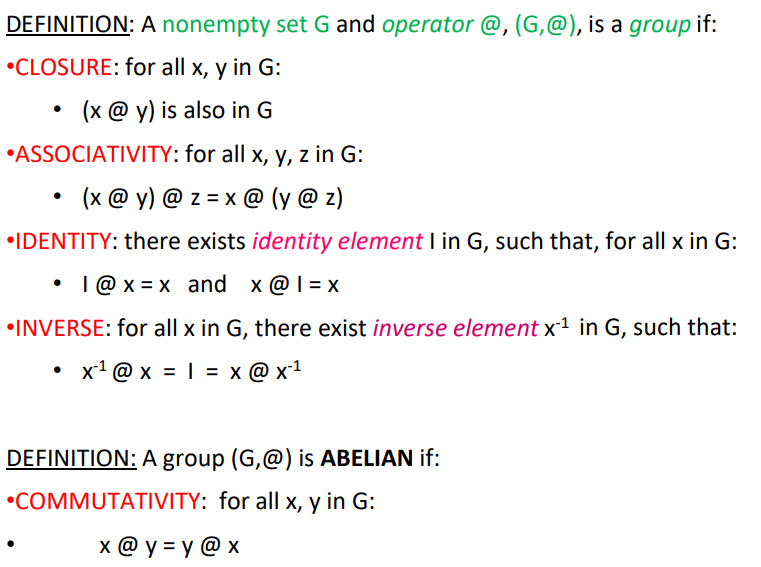

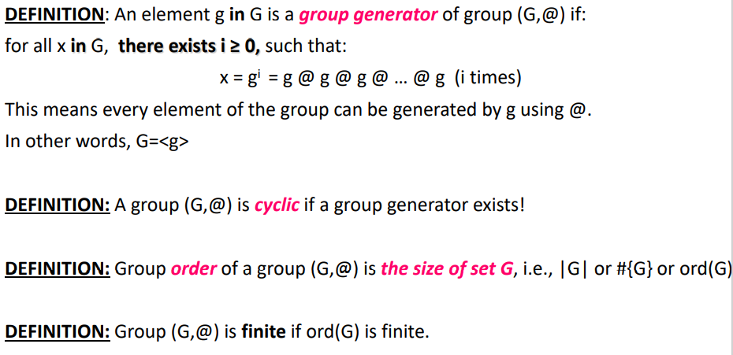

**Definition: ** The order of x is the smallest positive number k such that $x^k = 1$

**Definition: **  (H,@) is a subgroup of (G,@) if: 

* H is a subset of G 
* (H,@) is a group

##### Non-zero Integers mod(N) Relatively Prime to N

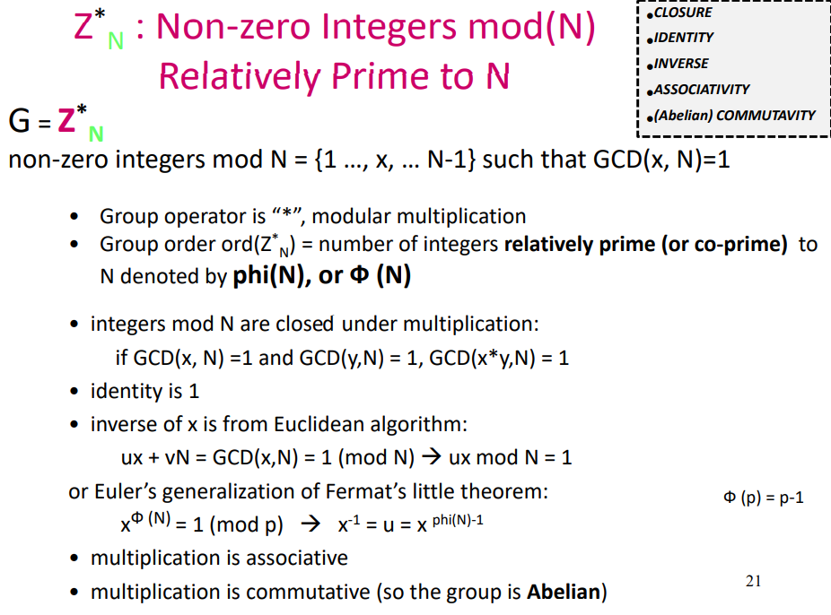

#### Euclidean Algorithm and Extended Euclidean algorithm

##### Theorem(Lagrange)

* Let G be a multiplicative group. For any g in G, ord(g) divides ord(G). ord(G) is the largest order of any element

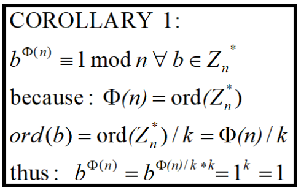

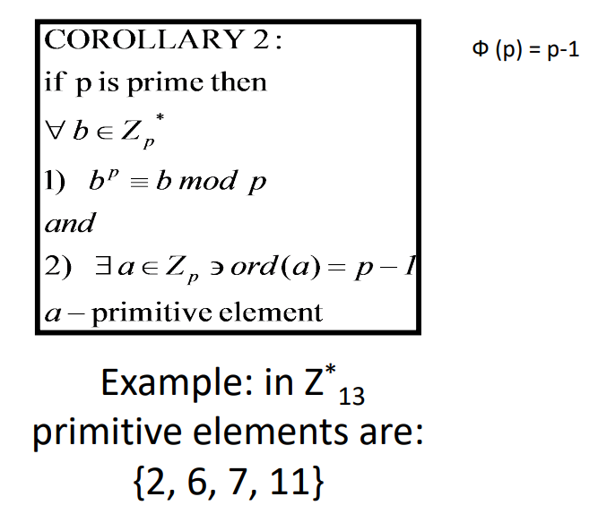

##### Euclidean Algorithm

* compute GCD(x, y)
* 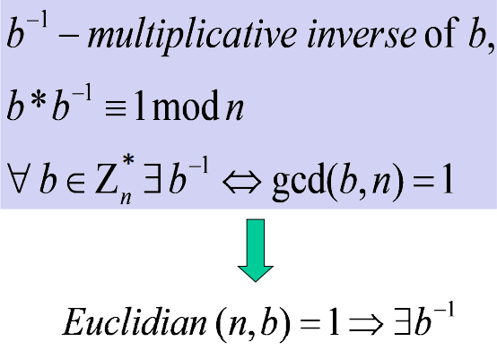
* 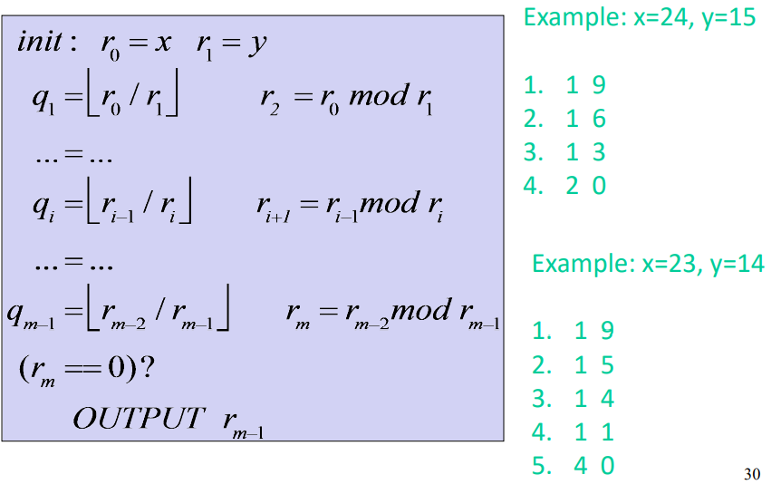

##### Extended Euclidean Algorithm

* Purpose: compute GCD(x,y) and inverse of y (if it exists)
* init: $r_0=x, r_1=y, t_0=0,t_1=1$ 
* 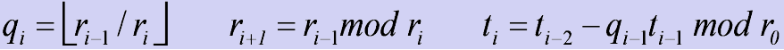
* 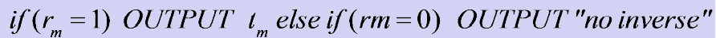

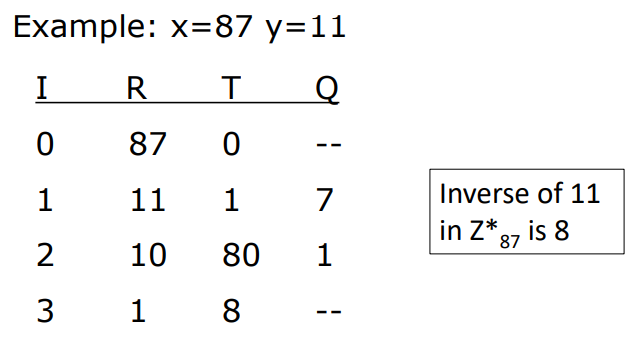

since 

#### Chinese Remainder Theorem (CRT)

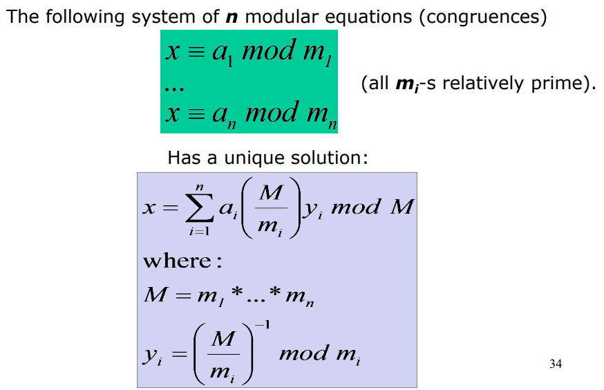

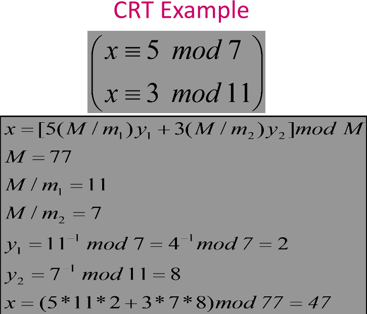

### Lec7: Public Key Cryptography I:Encryption + Signatures

#### Diffie Hellman Key Exchange

* Not for encryption by itself 

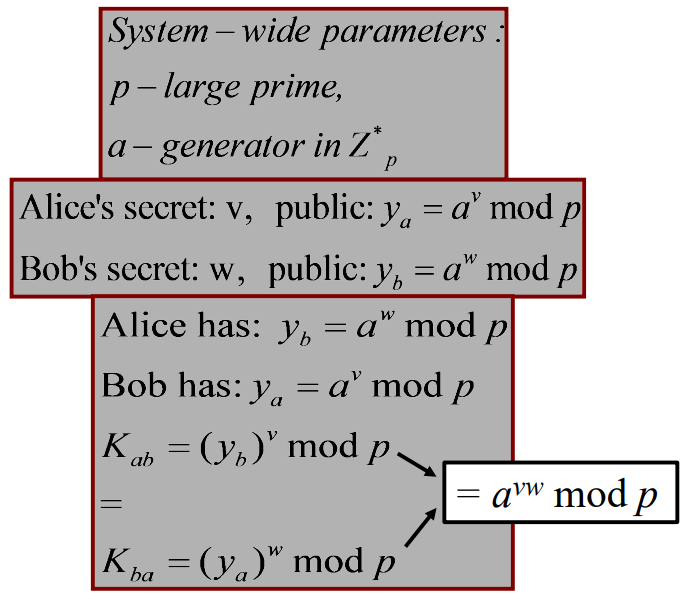

* Public Key Pre-distribution
  * Diffie-Hellman Problem
    * Given: $y_a = a^v \mod p$ and $y_b=a^w \mod p$
    * Find: $a^{vw} \mod p$
  * Discrete Log Problem
    * Given: $y_a = a^v \mod p$
    * Find: $v$
  * Decision DH Problem
    * Given:  $y_a = a^v \mod p$ and $y_b=a^w \mod p$
    * Distinguish: $K_{ab}=a^{vw} \mod p$ from a random number
  * All NP problem!
* Interactive (Public) Key Exchange
  * A->B: random choose $v$ and send $y_a$
  * B->A: random choose $w$ and send $y_b$
  * Compute $K_{ab}=(y_a)^w \mod p=(y_b)^v \mod p$
* The Man-in-the-Middle (MitM) Attack
  * Active Eve: 
    * get $y_a$ and send $u$ to communicate with A
    * send $u$ to B and get $y_b$ to communicate with B

#### RSA Encryption

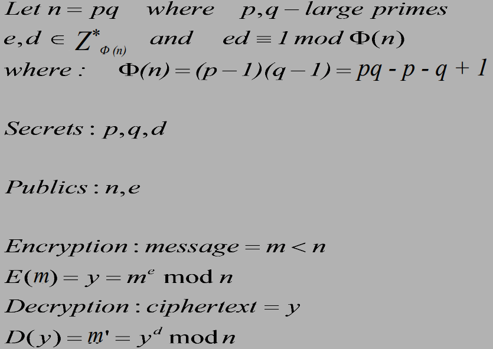

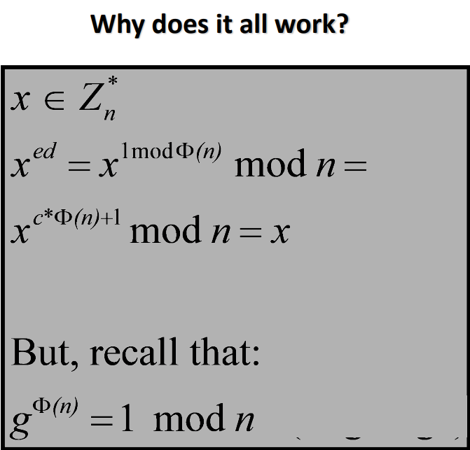

* breaking RSA is polynomially equivalent to factoring n 
* Exponentiation Costs
  * Integer multiplication -- $O(b^2)$
  * Modular reduction -- $O(b^2)$
  * => Thus, modular multiplication -- $O(b^2)$
  * Modular exponentiation (as in RSA) -- $m^e$ mod n
    * naive: e-1 modular products = $O(b^2*e)$
    * **Square-and-Multiply** -> O(log(e)*b^2)

* **Speeding up RSA Decryption**
  * 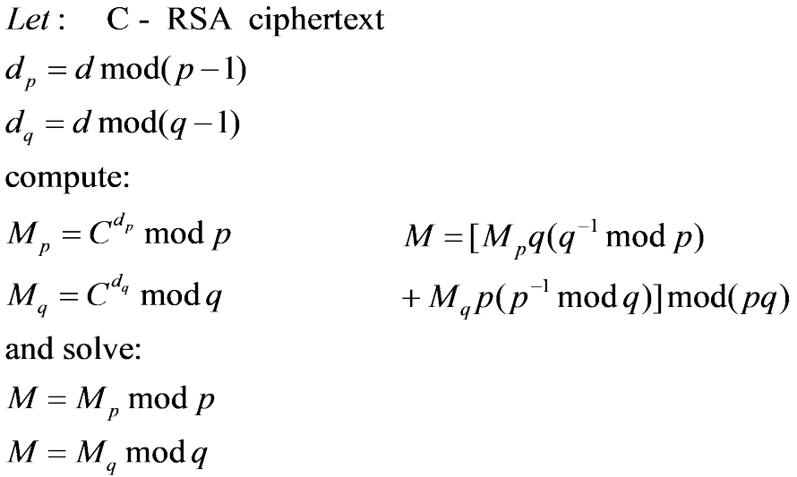
* More
  * Modulus n is unique per user 
    * 2 or more parties cannot share the same n
    * 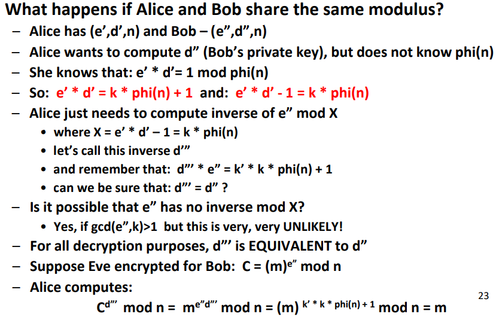
  * https://www.ruanyifeng.com/blog/2013/07/rsa_algorithm_part_two.html

#### El Gamal Encryption

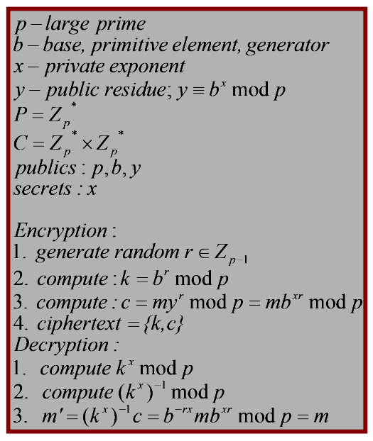

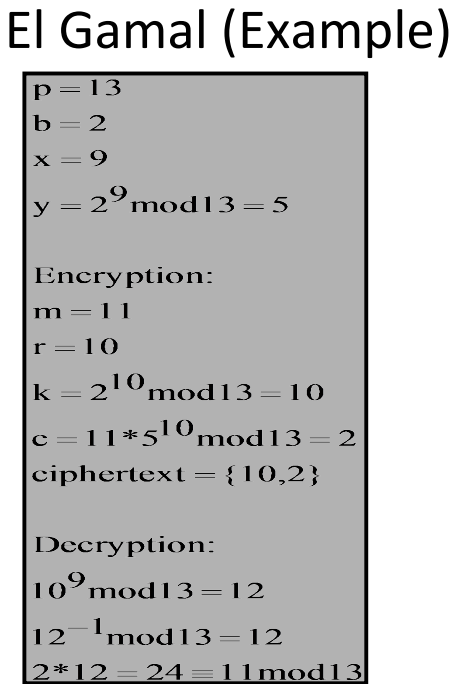

* Based on DH, but for encryption 
* Added randomness to improve the security against replay attacks

### Lec8: Public Key Cryptography II: Signatures (cont’d) + Identification

#### Digital Signatures (RSA, El Gamal, DSS)

* Properties:
  * Integrity 
  * Authentication 
  * Non-Repudiation:  can’t do with symmetric key cryptography
  * Time-Stamping 
  * Causality 
  * Authorization
* scheme
  * P - plaintext
  * A - signatures
  * K - keys
  * Sign - sign(P, K)->A
  * Verify - verify(P,A,K)->{0,1}

##### RSA Signature Scheme

* Sign(m): y=m ^d mod n
* Verify(y,m): (m==y^e)
* encryption reverses “decryption”: Signing by private key; Verification by public key
* Advantages:
  * Verification can be cheap (like RSA encryption) 
  * Mechanically same as RSA decryption function
  * Security based on RSA encryption
* Disadvantages:
  * RSA is malleable: signatures can be “massaged”
    * m1^d * m2^d = (m1*m2)^d
  * Phony “random” signatures (since rsa is reversible)
    * compute Y=RSA(e,X)=X^e mod n 
    * X is a signature of Y because Y^d=X mod n
* The Ugly:
  * needs integrity
  * signing message = m < n, so can't sign multiple blocks when m>n

##### EL Gamal Signature Scheme

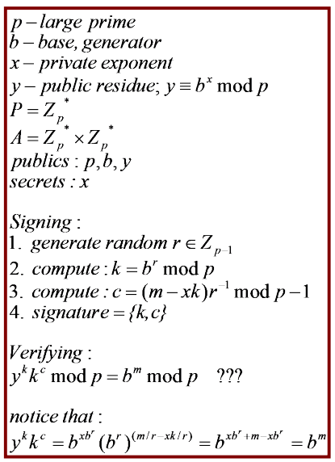

* The good: 
  * Signing is cheap(er) 
  * No phony signature since it is not designed to be reversible by encryption schemes 
  * Non-deterministic (randomized) 
* The bad: 
  * Need GOOD source of random numbers 
  * Randomizers cannot be revealed (trace) 
  * Randomizers cannot be reused

##### The Digital Signature Standard (DSS)

* A variant of El Gamal, but better performance
* Signing - 1 exp, 1 inv, verification - 2 exps, 1 inv
* 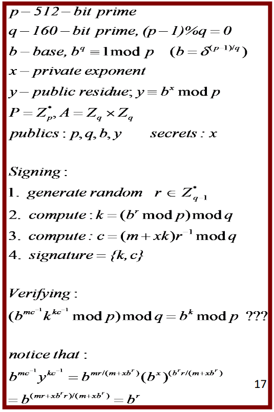

#### Merkle’s Puzzles

* （1）Alice准备一堆谜题E(K,m)，每个谜题的m都是以“Puzzle”后面接不同的Key和一个标示作用不同的X，假设谜题总共有2^32个。

  （2）Alice将所有的谜题发送给Bob。

  （3）Bob随机选择2^32中的一个解开，并将解密的Puzzle中的X返还给Alice。

  （4）Alice将拿到的X与自己的谜题作比较，找到相同X的，此谜题中的额Key就是Alice与Bob共有的Key。

  Alice需要O(n)时间来生成谜题，Bob需要O(n)时间来解密其中一道，而攻击者，即使拿到全部传递数据，也需要O(n^2)时间来解密。

* Smart construction, but DH is more practical
* Such quadratic gap is best possible if using symmetric crypto

#### Zero-Knowledge Proof and Fiat-Shamir scheme

* Identification/Authentication
  * Identification/authentication is an interactive protocol whereby one party: 
    * “prover” (who claims to be, say, Alice) convinces the other party: 
    * “verifier” (Bob) that she is indeed Alice
  * Identification/authentication can be accomplished with public key digital signatures 
    * However, signatures reveal information about private key
    * Also, signatures are “transferrable”
  * **Zero-knowledge proof**: prove ownership of a secret without revealing any info about the secret

##### Zero-knowledge proof

* [The Cave Analogy of Zero-Knowledge](https://www.freebuf.com/articles/blockchain-articles/235849.html)

  * 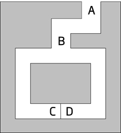
  * ①首先，验证者V站在A点，证明者P站在B点；

  ​    ②证明者P随机选择走到C点或D点，验证者V在A点无法看到证明者P选择的方向；

  ​    ③验证者V走到B点，并要求证明者P从左通道/右通道的方向出来；

  ​    ④证明者P根据验证者V的要求从指定方向出来，如有必要需要用秘密口令打开密门。
  
  * 如果证明者P知道秘密口令，就一定能正确地从验证者V要求的方向出来；如果证明者P不知道秘密口令，则每次有1/2的概率能从验证者V要求的方向出来。该证明过程可重复进行多次，直到验证者V相信证明者P拥有打开密门的秘密口令。

##### Fiat-Shamir Identification Scheme

* prover has an RSA-like modulus n = pq where p and q are large primes and factorization of n is secret
* Secret Key: Prover (P) chooses a random value 
  
* 1 < S < n (to serve as the key) such that gcd(S,n) = 1
  
* Public Key: P computes I=S^2 mod n, publishes (I,n) as his public key. 
  
  * Assumption: Finding square roots mod n is at least as hard as factoring n
* Purpose of the protocol: P has to convince verifier (V) that he knows the secret S corresponding to the public key (I,n)
  
*  to prove that he knows a square root of I mod n, without revealing S or any portion thereof
  
* V wants to authenticate identity of P, who claims to have a public key I. Thus, V asks P to convince him that P knows the secret key S corresponding to I . 
* 1. P chooses at random 1 < R < n and computes: **X = R^2 mod n**
  2. P sends X to V
  3. V randomly requests from P one of two things (0 or 1): 
     1. R 
     2. RS mod n
  4. P sends requested information
  5. V checks the correct answer:
     1. R : checking **(R^2 ?=x mod n)**
     2. RS mod n : checking **(RS)^2 ?= xI mod n**
  6.  If verification fails, V concludes that P does not know S
  7.  Protocol is repeated t (usually 20, 30, or log n) times, and, if each one succeeds, V concludes that P is the claimed party. 

* Proof:

  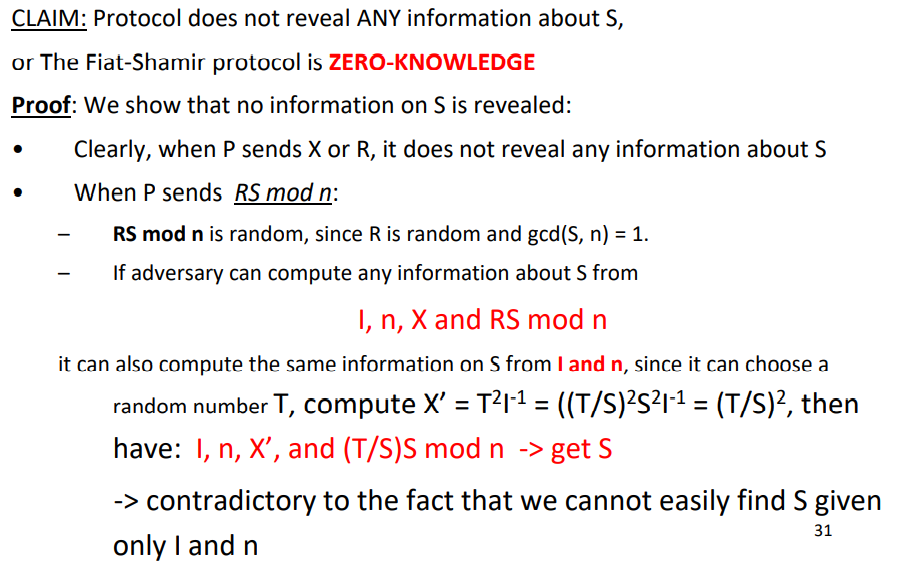

* Security:

  * If P does not know S, it can either: 

    * Choose to send x=R^2 mod n, but in this case cannot provide RS mod n 

      => CANNOT answer query = 1

    * Choose to send x=R^2*I mod n, so that can answer query = 1 correctly. 

      => But, in this case, P cannot answer query = 0, since to do so, needs to know S 

  * In any case, adversary cannot answer both questions 

* Since P does not know in advance (when choosing R or RS mod n) which question that V will ask, he cannot foresee the required choice. He can succeed in guessing V’s question with probability 1/2 for each question.

### Lec9:  Authentication and Key Distribution

* Definitions 

  * A **protocol **is a set of rules for exchanging messages between 2 or more entities/parties 

    * A protocol has a number of rounds (>1) and a number of messages (>1)

  * A **message **is a unit of information/data sent from one entity/party to another as part of a protocol

  * A **round **is a basic unit of protocol time:

    * Wake up because of: 

      a) Alarm clock 

      b) Initial start or 

      c) Receive message(s) from other(s) 

    * Compute something 
    * Send message(s) to others 
    * Repeat steps 2-3, if needed 
    * Wait for message(s) or sleep until alarm clock 

  * When acting honestly, entities=parties=participants achieve the stated **goal **of the protocol

    * Adversary can try to defeat this goal

  * More complex protocols may involve a Trusted Third Party (TTP)

* Types of Authentication 

  * **Entity** Authentication
    * **Unilateral** Authentication
    * **Mutual** Authentication
  * Basis for Authentication
    * Something you **know**, such as PIN or password
      * PW-based: Kerberos
      * However, human is not reliable
    * Something you **have**: 银行卡
      * SecureID tokens (RSA)
      * generate one time auth
    * Something you **are**: 
      * Biometric-based: retina scanners / thumbprint / Handwriting 
      * However, Accuracy? Suitability? Stability?
      * fingerprint: vulnerability? applicability issues like growing kids, damaged fingerprints? stability?
      * voice: tape recorder? noises? change voice machine?
      * non-digital signatures?
    * Authentication Protocols
      * Fiat-Shamir
      * Conventional and public key-based 

* Protocols 
  * 1.0: only claim
  * 2.0: claim+IP
  * 3.0: claim+IP+password => replay attack: record the packet and replay
  * 3.1: claim+IP+encrypted password => replay attack 
  * 4.0: => to avoid
    * **Nonce**: number used once (R)
    * A->B: claim
    * B->A: R
    * A->B: E(K, R)
    * required shared symmetric key
    * =>man in the middle attack
  * 5.0: auth use public key
    * A->B: claim+PK_A
    * B->A: R
    * A->B: SIGN(SK_A, R)
* Key Distribution